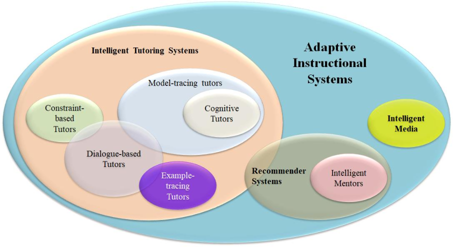

# The Nifty Project
The Nifty project is a framework for creating adaptive instructional systems.

### Adaptive Instructional Systems

### Related Projects
[GIFT](https://gifttutoring.org/), [Bot Framework](https://github.com/microsoft/botframework-sdk), [TweetyProject](https://github.com/TweetyProjectTeam/TweetyProject), [Infer.NET](https://github.com/dotnet/infer), [LearnLib](https://github.com/learnlib/learnlib), [AutomataLib](https://github.com/learnlib/automatalib), [Jena](https://jena.apache.org/), [DotNetRdf](https://github.com/dotnetrdf/dotnetrdf/), [LinqToRdf](https://github.com/aabs/LinqToRdf), [TinCan.NET](https://github.com/RusticiSoftware/TinCan.NET), [OpenXes.Net](https://bitbucket.org/sabien/openxes.net/), [Reactive](https://github.com/dotnet/reactive), [ReactiveUI](https://github.com/reactiveui/ReactiveUI), [DynamicData](https://github.com/reactivemarbles/DynamicData)

### Related Standards
[RDF](https://www.w3.org/RDF/), [OWL](https://www.w3.org/OWL/), [SPARQL](https://www.w3.org/TR/sparql11-query/), [SPIN](https://spinrdf.org/), [xAPI](https://github.com/adlnet/xAPI-Spec), [XES](https://xes-standard.org/)

### Related Standards Organizations
[Adaptive Instructional Systems Working Group](https://sagroups.ieee.org/2247-1/), [W3C](https://www.w3.org/)

### Related Design Recommendations
* [Design Recommendations for Intelligent Tutoring Systems – Volume 1 (Learner Modeling)](https://aisconsortium.com/wp-content/uploads/Design-Recommendations-for-ITS_Volume-1-Learner-Modeling.pdf)
* [Design Recommendations for Intelligent Tutoring Systems – Volume 2 (Instructional Management)](https://aisconsortium.com/wp-content/uploads/Design-Recommendations-for-ITS_Volume-2-Instructional-Management.pdf)
* [Design Recommendations for Intelligent Tutoring Systems – Volume 3 (Authoring Tools)](https://aisconsortium.com/wp-content/uploads/Design-Recommendations-for-ITS_Volume-3-Authoring-Tools.pdf)
* [Design Recommendations for Intelligent Tutoring Systems – Volume 4 (Domain Modeling)](https://aisconsortium.com/wp-content/uploads/Design-Recommendations-for-ITS_Volume-4-Domain-Modeling.pdf)
* [Design Recommendations for Intelligent Tutoring Systems – Volume 5 (Assessment Methods)](https://aisconsortium.com/wp-content/uploads/Design-Recommendations-for-ITS_Volume-5-Assessment.pdf)
* [Design Recommendations for Intelligent Tutoring Systems – Volume 6 (Team Tutoring)](https://aisconsortium.com/wp-content/uploads/Design-Recommendations-for-ITS_Volume-6-Team-Tutoring.pdf)
* [Design Recommendations for Intelligent Tutoring Systems – Volume 7 (Self Improving Systems)](https://aisconsortium.com/wp-content/uploads/Design-Recommendations-for-ITS_Volume-7-Self-Improving-Systems.pdf)

### Technical Overview
Some preliminary technical overview of the project is available [here](OVERVIEW.md).